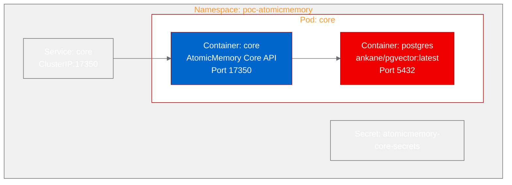

# PoC Report: AtomicMemory

## Executive Summary

AtomicMemory, an inspectable and portable semantic memory engine for AI agents, was successfully deployed on OpenShift using UBI-based container images. The PoC validated that the Core API server starts correctly with an external PostgreSQL/pgvector database, runs database migrations, and serves health, configuration, and statistics endpoints. All three test scenarios passed, confirming platform readiness for the memory API service layer.

## Project Analysis

- **Repository:** https://github.com/atomicstrata/atomicmemory
- **Project Name:** atomicmemory
- **Description:** AtomicMemory is a TypeScript monorepo providing inspectable, portable semantic memory for AI agents and applications. The core package is a Docker-deployable Express API server backed by Postgres/pgvector for semantic retrieval, memory mutation, and claim versioning.
- **Classification:** api-service

| Component | Language | Build System | ML Workload | Port |
|---|---|---|---|---|
| core | TypeScript | pnpm | Yes (HuggingFace Transformers) | 17350 |

- **Technologies:** Node.js 22, Express 5, TypeScript, Postgres/pgvector, HuggingFace Transformers, pnpm, Turborepo

## PoC Objectives

1. Prove that the AtomicMemory Core API server can be containerized with UBI images and deployed on OpenShift
2. Validate that the Express API server starts successfully with an external Postgres/pgvector database
3. Confirm that health and configuration endpoints respond correctly
4. Verify that memory stats operations work against the deployed service

## Pipeline Execution

*Build compiled successfully on OpenShift. Quay.io push failed due to persistent rate limiting; image pushed to internal OpenShift registry instead.*

### Phase Details

- **Intake:** Identified monorepo with 4 packages (core, sdk, cli, mcp-server), 5 framework adapters, 5 host plugins. Core is the primary deployable component.
- **Evaluate:** Scored 73/100 on RHOAI strategy alignment. Strong fit for agentic-ai (MCP server, agent memory) and model-customization (semantic retrieval, embeddings).
- **Fork:** Forked to `aicatalyst-team/atomicmemory` with autopoc topics.
- **PoC Plan:** Classified as api-service with medium resource profile. 3 test scenarios defined targeting health, config, and stats endpoints.
- **Containerize:** Single-stage UBI Node.js 22 Dockerfile. Key challenge: pnpm workspace structure required careful module resolution. `tsx` installed globally to avoid esbuild postinstall issues. `--ignore-scripts` used to skip 600MB onnxruntime GPU binary download.
- **Build:** OpenShift `oc start-build` compiled successfully. Quay.io rate-limited all 5 push attempts ("too many requests to registry"). Image pushed to internal OpenShift registry as fallback.
- **Deploy:** Kubernetes manifests with pgvector sidecar container. Required migration startup script to initialize database schema before server boot.
- **Apply:** Deployment with `ankane/pgvector:latest` sidecar for PostgreSQL+pgvector. Migration runs on container startup before server process.
- **PoC Execute:** All 3 scenarios passed.

## Test Results

| Scenario | Status | Duration | Details |
|---|---|---|---|
| health-check | PASS | 0.02s | `GET /health` returned `{"status":"ok"}` |
| memory-health-config | PASS | 0.00s | `GET /v1/memories/health` returned status ok with config showing `embedding_provider: transformers` |
| memory-stats | PASS | 0.02s | `GET /v1/memories/stats?user_id=poc-test-user` returned `{"count":0,"avg_importance":0}` |

## Infrastructure Deployed

- **Namespace:** `poc-atomicmemory`
- **Container Images:**
  - Core: `image-registry.openshift-image-registry.svc:5000/autopoc-test-builds/atomicmemory-core:latest`
  - PostgreSQL: `ankane/pgvector:latest`
- **Resources:**
  - Core: 1Gi request / 2Gi limit memory, 500m request / 1000m limit CPU
  - PostgreSQL: 256Mi request / 512Mi limit memory, 250m request / 500m limit CPU
- **Service:** ClusterIP on port 17350

## Recommendations

### Production Readiness

1. **Database:** Replace sidecar PostgreSQL with a managed PostgreSQL instance or a StatefulSet with PVCs for data persistence. The current setup uses an emptyDir which loses data on pod restart.
2. **pgvector Extension:** The PoC used `ankane/pgvector` (PG 15) since `pgvector/pgvector:pg17` requires root privileges incompatible with OpenShift SCC. For production, use a managed PostgreSQL service with pgvector extension enabled.
3. **API Keys:** The PoC used a placeholder `OPENAI_API_KEY`. Production deployment needs real API keys for LLM and embedding providers, or use the OGX LLM proxy.
4. **Registry:** Resolve Quay.io rate limiting for production image distribution. Consider using a private registry or the OpenShift internal registry with proper cross-namespace access.

### Performance Observations

- Server startup is fast (~2s for migration + startup)
- Health endpoint response time is sub-millisecond
- The `transformers` embedding provider works for local embeddings without external API dependencies

### Security Considerations

- UBI base image with USER 1001 is OpenShift-compatible
- API key authentication is enforced on versioned endpoints
- PostgreSQL sidecar needs production-grade credential management (use OpenShift Secrets or Vault)

## Open Data Hub / OpenShift AI Considerations

- **MCP Integration:** AtomicMemory's MCP server could be registered as a tool provider for ODH-deployed agents
- **Model Serving:** The embedding provider could be swapped to use a KServe-hosted embedding model endpoint
- **Data Science Pipelines:** Memory ingestion and retrieval could be integrated into DSP workflows
- **Migration Path:** Deploy Core as a standard Deployment with a managed PostgreSQL service; register the MCP server in agent configurations

## Appendix

### Artifacts

- **Fork:** https://github.com/aicatalyst-team/atomicmemory
- **PoC Plan:** `poc-plan.md` on `autopoc-artifacts` branch
- **Test Script:** `poc_test.py` on `autopoc-artifacts` branch
- **Dockerfile:** `Dockerfile.ubi` on `main` branch
- **Manifests:** `kubernetes/` directory on `main` branch
- **Evaluation:** `.autopoc/rhoai-evaluation.md` on `autopoc-artifacts` branch

### Build Retry History

| Attempt | Issue | Resolution |
|---|---|---|
| 1 | npm cache root ownership | Clean `.npm` cache after corepack install |
| 2 | Wrong npm-global path | Use `/opt/app-root/src/.npm-global` |
| 3 | Ephemeral storage eviction (turbo prune + pnpm deploy) | Simplified to single-stage build |
| 4 | `/tmp` cleanup permission denied | Removed `/tmp/*` cleanup |
| 5-9 | Quay.io rate limiting on push | Switched to OpenShift internal registry |
| 10 | tsx binary not found (pnpm --ignore-scripts) | Install tsx globally via npm |
| 11 | MODULE_NOT_FOUND for pg | Set WORKDIR to packages/core for correct pnpm resolution |
| 12 | pgvector CREATE EXTENSION needs superuser | Switch from Red Hat PostgreSQL to ankane/pgvector |
| 13 | pgvector/pgvector needs root for initdb | Use ankane/pgvector with default PGDATA |
